# Intelligent Candidate Discovery

**Semantic Candidate Discovery and Hybrid Ranking Engine**

A production‑grade pipeline that transforms 100,000 unstructured candidate profiles into a ranked shortlist of the 100 most relevant individuals for a given job description. Built for the **INDIA.RUNS AI Resume Challenge**, this system combines multi‑intent semantic retrieval with 22 engineered features, a consistency and honeypot detection engine, and deterministic, fact‑based reasoning — all running on a single CPU core within a strict 5‑minute budget.

---

## Pipeline Architecture

```
Raw Candidates (100k JSONL)
        │
        ▼
  Clean & Normalize
        │
        ├──────────────────────────┐
        ▼                          ▼
  Multi‑Intent JD Parsing    Candidate Embedding
  (5 intent embeddings)      (4 document views)
        │                          │
        └──────────┬───────────────┘
                   ▼
          Semantic Retrieval
          (Cosine Similarity → Top 1000)
                   │
                   ▼
          Feature Engineering
          (22 signals across 6 groups)
                   │
                   ▼
          Consistency & Honeypot Engine
                   │
                   ▼
          Hybrid Reranking
          (Weighted combination → Final Score)
                   │
                   ▼
          Deterministic Reasoning
                   │
                   ▼
            Top‑100 as CSV
```

The pipeline is fully reproducible and runs in two stages: an offline preprocessing phase that generates embeddings and feature tables, and an online ranking phase that completes in under 4 seconds.

---

## Key Design Decisions

- **All‑Python, CPU‑only.** No GPU, no external API calls. Embeddings are produced with `all-MiniLM-L6-v2` (384 dimensions) and stored as `float16` NumPy arrays.
- **Explainable by construction.** The final ranking is a linear combination of normalised features with fixed, documented weights. No black‑box models.
- **Honeypot‑aware.** A dedicated consistency engine penalises profiles with impossible career timelines, expert skills lacking evidence, or domain mismatches between current title and career history.
- **Recruiter‑friendly demo.** An interactive Streamlit dashboard exposes the ranking, side‑by‑side comparisons, decision traces, and the final validated submission.

---

## Feature Groups

| Group | Examples |
|-------|----------|
| **Semantic** | Full‑document similarity, intent‑weighted similarity, skills/career similarity |
| **Career Evidence** | Explicit search/ranking experience, build‑ownership language, product‑company ratio |
| **Skill Depth** | Core skill overlap, weighted skill score, advanced/expert counts, assessment scores |
| **Behavioral** | Recruiter response rate, interview completion, profile views, activity recency |
| **Availability** | Notice period, location match, work‑mode match, open‑to‑work flag |
| **Quality** | Profile completeness, consistency score, honeypot penalty, endorsement counts |

All features are min‑max normalised across the candidate pool and combined into a single final score using weights aligned with the job description’s explicit priorities.

---

## Evaluation Results

### Executive Summary

| Metric | Value |
|--------|-------|
| Candidates Processed | 100,000 |
| Retrieved Pool | 1,000 |
| Final Shortlist | 100 |
| Avg Final Score (Top 100) | 0.811 |
| Avg Semantic Retrieval | 0.994 |
| Avg Profile Consistency | 0.882 |
| Avg Notice Period | 29 days |
| Open‑to‑Work Rate | 62% |
| Unique Companies in Top 100 | 63 |
| Unique Job Titles | 59 |
| Validation Checks Passed | 10/10 |
| Reasoning Coverage | 100% |
| Ranking Runtime (Top 1000) | 0.234 s |
| Full Online Pipeline | 3.91 s |
| Peak RAM | 155 MB |

### Score Separation

The final score decreases smoothly across the top 100, demonstrating a discriminative ranking rather than a clustered tie.

| Rank | Final Score |
|------|-------------|
| 1 | 0.8584 |
| 10 | 0.7849 |
| 25 | 0.7507 |
| 50 | 0.7179 |
| 100 | 0.6085 |

**Average consecutive gap:** 0.0025  
**Score range:** 0.2499

### Lift Analysis

The top 100 candidates are objectively stronger than the full retrieved pool.

- Pool average final score: **0.654**
- Top 100 average final score: **0.811**
- Lift factor: **1.24x**

### Feature Alignment

Spearman correlation between the final score and key signals confirms that the ranking is driven by meaningful features.

| Signal | Spearman ρ |
|--------|------------|
| Retrieval Score | 0.89 |
| Profile Consistency | 0.62 |
| Product‑Company Ratio | 0.41 |

### Feature Group Contribution

Ablation analysis reveals the relative importance of each feature group to the final ranking.

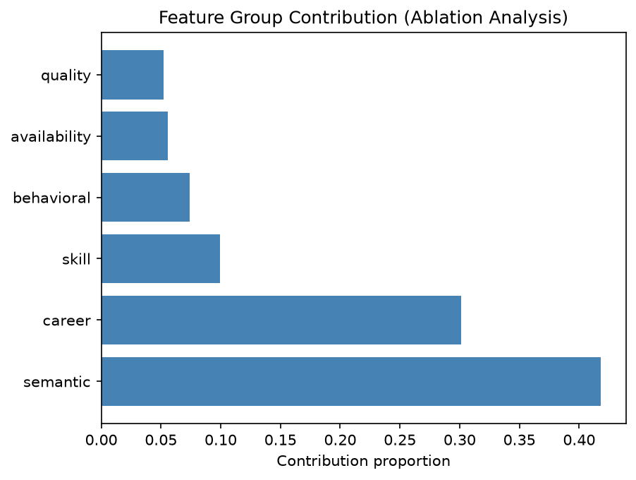

### Distribution Plots

**Final Score Distribution**  
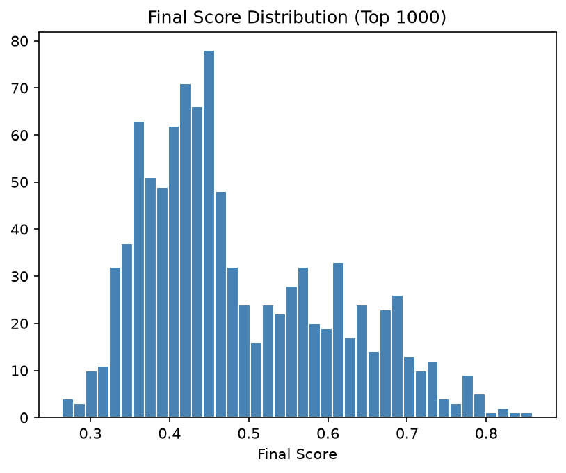

**Retrieval Score Distribution**  
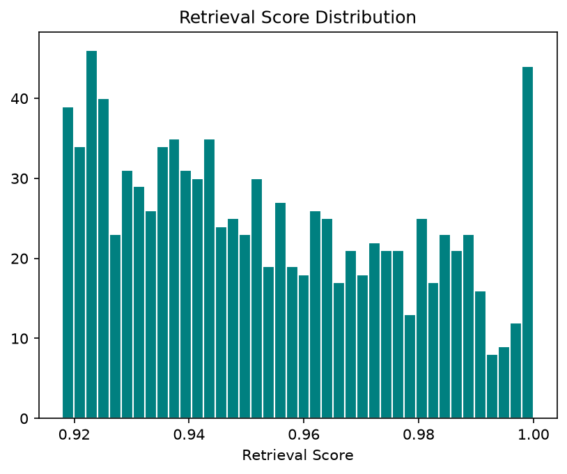

**Consistency Score Distribution**  
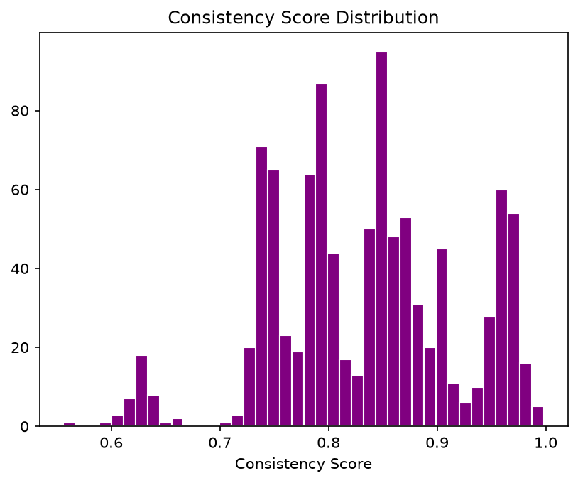

**Notice Period Distribution**  
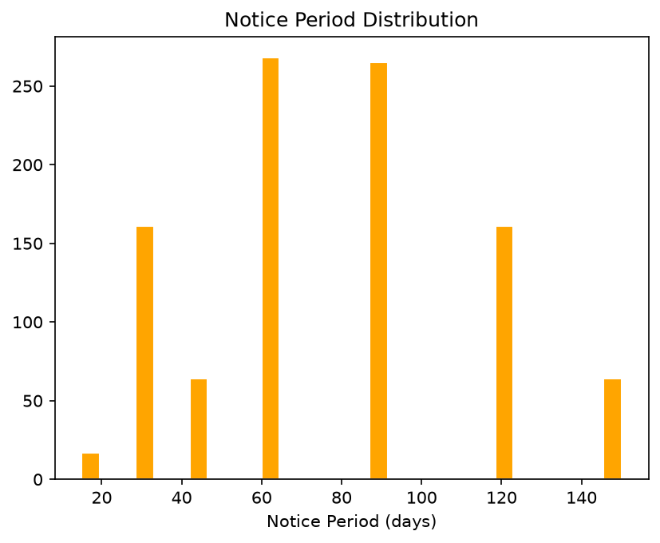

**Experience Distribution (Top 1000)**  
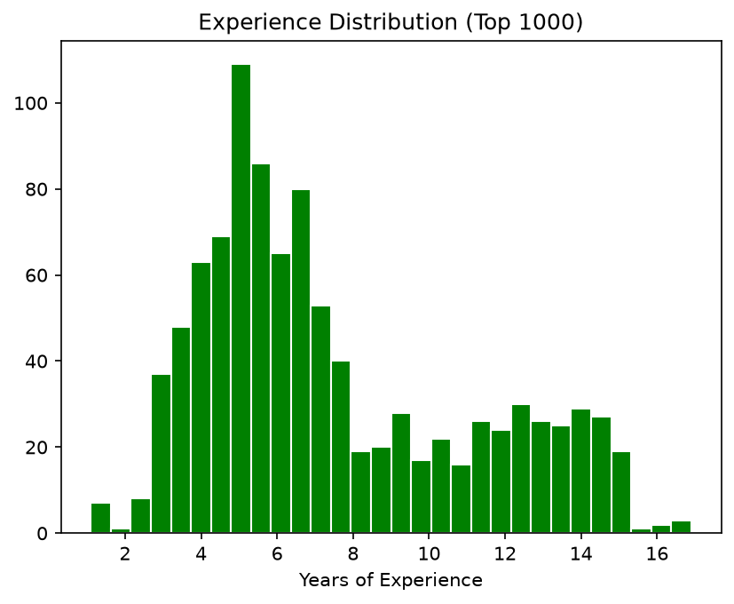

**Ranking Curve (Top 100)**  
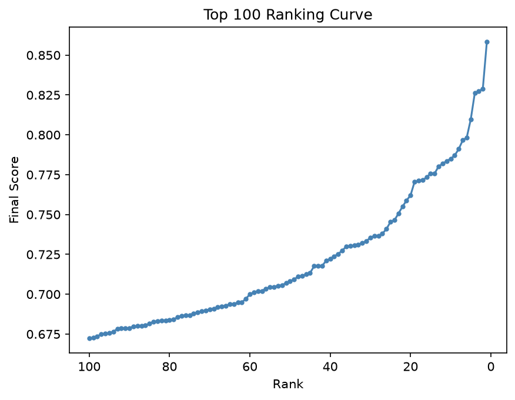

**Retrieval vs Rank**  
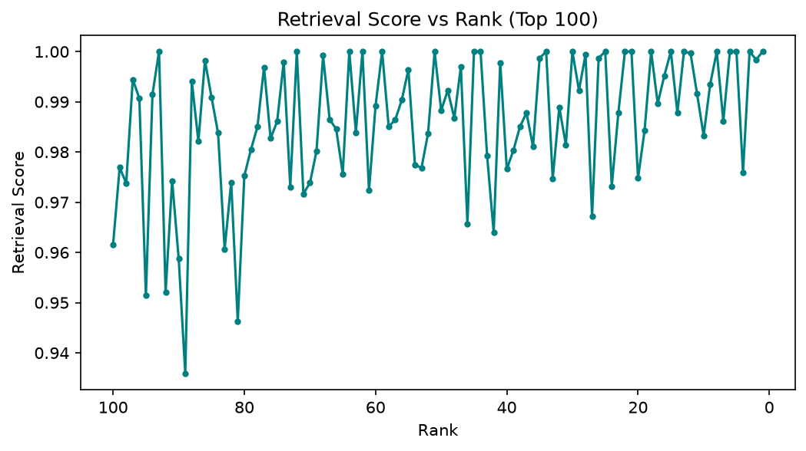

**Consistency vs Rank**  
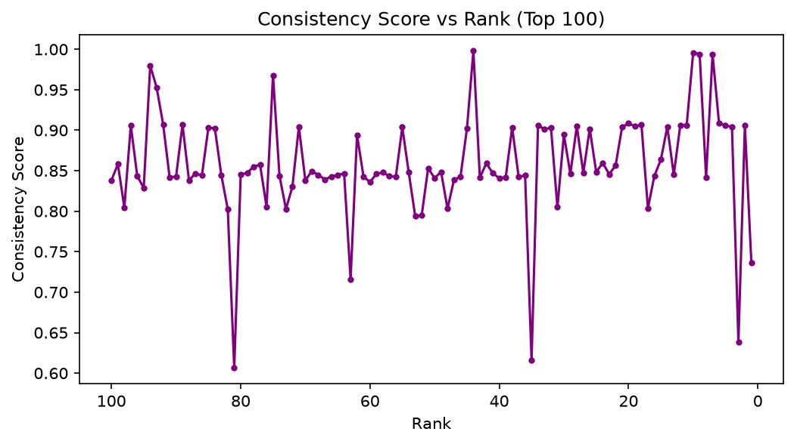

**Score Gap Distribution**  
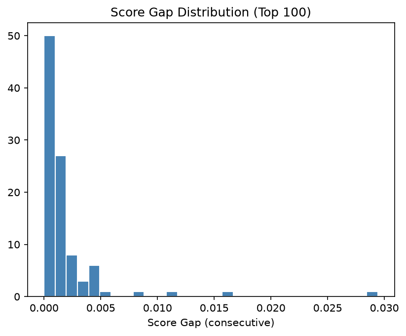

**Top 10 Companies in Top 100**  
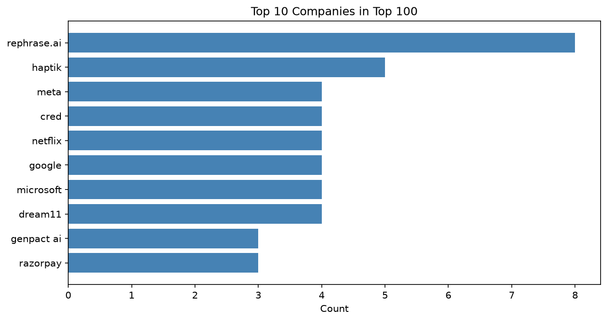

**Correlation Heatmap**  
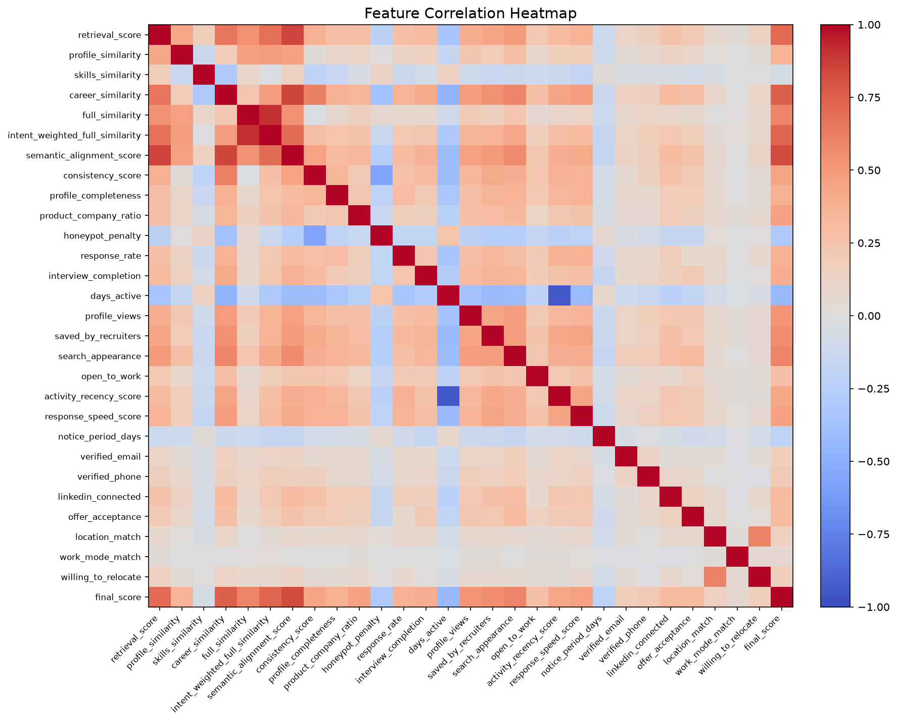

**Feature Coverage**  
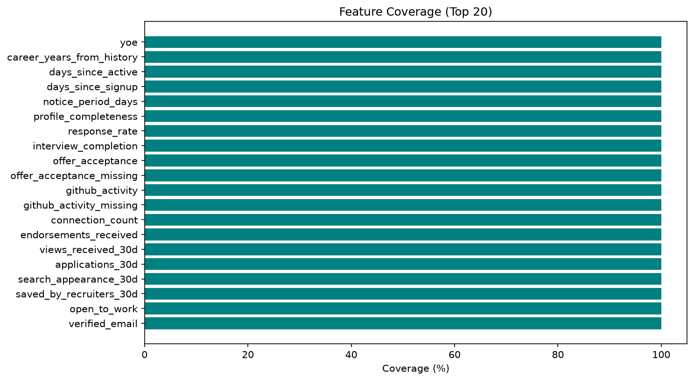

---

## Performance & Constraints

The ranking step adheres to the challenge’s strict compute limits:

- **Runtime:** The online pipeline (loading + retrieval + ranking + CSV generation) completes in **3.91 seconds** on a single CPU core, well within the 5‑minute ceiling.
- **Memory:** Peak RAM usage during ranking is **155 MB**, utilising memory‑mapped embeddings and compact Parquet artifacts.
- **No GPU, no network.** Embeddings are precomputed offline; the ranking step uses only local, pre‑stored data.
- **Throughput:** **4,272 candidates ranked per second** during the hybrid scoring stage.
- **Scalability:** The pipeline reduces the initial 100,000 candidates to 1,000 via semantic retrieval, then to 100 via feature‑based reranking — a **99.9% reduction** while preserving high‑quality matches.

A detailed performance profile is available in `reports/performance_profile.json`.

---

## Getting Started

### Prerequisites

- Python 3.10+
- 16 GB RAM (for preprocessing; ranking uses ~155 MB)
- All dependencies listed in `requirements.txt`

### Installation

```bash
git clone https://github.com/Inteegrus-Research/intelligent-candidate-discovery.git
cd india-runs-redrob
python -m venv venv
source venv/bin/activate  # Linux/Mac
pip install -r requirements.txt
```

### Pipeline Execution

**1. Preprocessing (run once, ~30 minutes)**
```bash
python src/prepare_candidates.py            # Clean & normalize raw data
python src/build_jd_embeddings.py           # Generate 5 JD intent embeddings
python src/build_candidate_embeddings.py    # Embed all 100k candidates
python src/build_features.py                # Extract 22 engineered features
python src/build_consistency_features.py    # Consistency & honeypot engine
```

**2. Ranking & Submission**
```bash
python src/rank_candidates.py               # Retrieve top 1000, rerank, generate reasoning
python src/generate_submission.py           # Output the final top‑100 CSV
python tools/validate_submission.py submissions/submission.csv
```

**3. Launch Demo Dashboard**
```bash
streamlit run app/app.py
```

### Evaluation & Profiling

```bash
python tools/evaluate_pipeline.py          # Full evaluation suite
python tools/profile_pipeline.py           # Runtime & memory profiling
python tools/ranking_insights.py           # Ranking quality insights
```

All outputs are saved to the `reports/` directory.

---

## Repository Structure

```
india-runs-redrob/
├── app/
│   └── app.py                     # Streamlit demo dashboard
├── data/
│   ├── artifacts/                 # Precomputed embeddings, features, scores
│   └── raw/                       # Original challenge dataset
├── reports/                       # Evaluation reports, plots, and summaries
│   ├── plots/                     # All generated visualisations
│   ├── evaluation.json
│   ├── performance_profile.json
│   ├── ranking_insights.json
│   ├── ranking_summary.csv
│   └── README_METRICS.md
├── submissions/
│   ├── submission.csv             # Final top‑100 ranking
│   ├── presentation.pptx          # Challenge presentation
├── src/
│   ├── features/                  # Feature extraction modules
│   ├── retrieval/                 # Embedding & intent parsing
│   ├── scoring/                   # Consistency engine & hybrid ranker
│   ├── build_*.py                 # Preprocessing scripts
│   ├── prepare_candidates.py
│   └── generate_submission.py
├── tools/                         # Validation, evaluation, profiling
│   ├── validate_submission.py
│   ├── evaluate_pipeline.py
│   ├── profile_pipeline.py
│   └── ranking_insights.py
├── requirements.txt
└── README.md
```

---

## Submission Assets

- **Final Ranking CSV:** `submissions/submission.csv` (100 rows, validated)
- **Presentation Deck:** `submissions/presentation.pptx`
- **Interactive Demo:** Streamlit dashboard (see Getting Started)
- **Code Repository:** Full source code with reproduction instructions

---

## Methodology Deep‑Dive

For a complete walkthrough of the ranking algorithm, feature engineering, consistency engine, and evaluation methodology, refer to the presentation deck and the inline documentation in the source files under `src/`. The system is designed to be fully auditable: every feature, weight, and rule is explicitly coded and can be traced from input to output.

---

## License

This project is submitted for the INDIA.RUNS AI Resume Challenge. All rights reserved by the authors.
